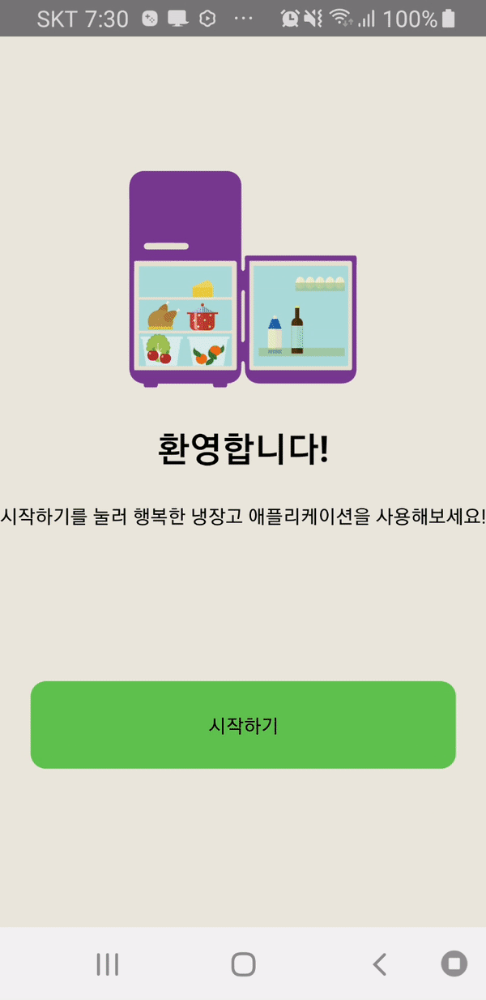
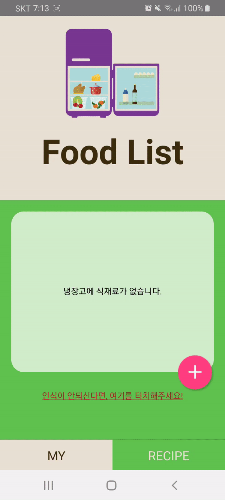
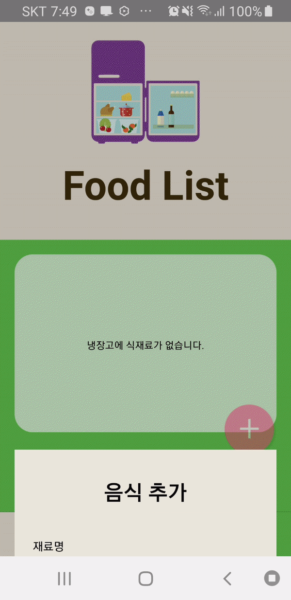

# 행복한 냉장고

## 요약

냉장고 스스로 식료품 및 식료품 라벨을 인식할 수 있고 사용자가 직접 식료품을 관리하는 '행복한 냉장고' 솔루션 프로젝트입니다.

- 프로젝트 기간: 2019.03.02 - 2019.11.22 (약 9개월)
- 실 개발 기간: 2019.07.01 - 2019.11.20 (약 5개월)
- 개발 인원: 4명 (AI 개발 1명, 하드웨어 개발 1명, 애플리케이션 개발 1명, 디자인 1명)
- 개발 스택: Tessaract, OpenCV, Caffe, Raspberry pi, React Native
- 담당 업무: React Native를 활용한 애플리케이션 개발 및 데이터베이스 구축

## 기능

- 냉장고 등록: 냉장고 시리얼 번호가 저장된 QR코드를 애플리케이션에서 인식하여 냉장고를 등록할 수 있습니다. 1회 등록 이후로는 식료품 관리 메뉴로 바로 이동합니다.

	
	

 
 

- 식료품 관리: raspberry pi와 연결된 카메라로 식료품을 인식시키거나 식료품 라벨을 스마트폰 카메라로 인식 또는 사용자가 직접 식료품 정보를 입력하여 식료품을 등록할 수 있습니다. 리스트에서 식료품명, 갯수, 유통기한의 정보를 제공하며 사용자가 직접 식료품 정보를 수정할 수 있습니다.

	
	
	

 
 

- 레시피 추천: 현재 냉장고에 존재하는 식료품을 활용한 레시피를 추천합니다. 식료품의 유통기한이 가장 짧은 레시피를 우선 추천하며 레시피의 각 항목을 선택하여 자세한 내용을 확인할 수 있습니다.

 
 

## 히스토리

아래에 커밋 상세 내용을 최신 순으로 기술하였습니다.

### Upload README.md
- README.md를 업로드하였습니다.

### initial commit
- 애플리케이션 전체 소스코드를 업로드하였습니다.